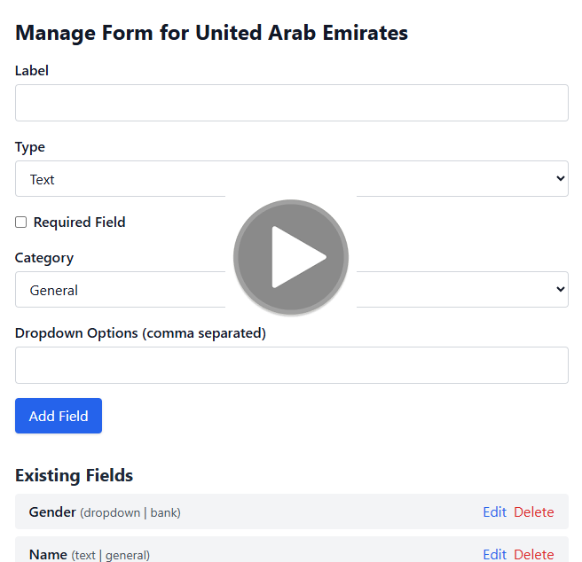

# Dynamic Form System – Laravel Full Stack Project

This Laravel application implements a dynamic form builder and registration system that allows administrators to configure country-specific registration forms, and users to register using those dynamic forms.

## 📽️ Project Demo

<a href="https://drive.google.com/file/d/1y_eXSQi9wIjULVWGAnWIMRSCPEgpKDXN/view?usp=sharing" target="_blank">
  
</a>


## 📦 Features

### 1. Dynamic Field Creation

- Admins can create and customize registration fields for each country.
- Each field includes:
    - Type: text, number, date, or dropdown
    - Requirement status: Required or Optional
    - Category: general, identity, or bank

### 2. Form Editing and Updates

- Admins can:
      - Add new fields
      - Modify existing field properties (type, requirement, etc.)
- The system ensures that:
      - Previously submitted data is preserved
      - Validation aligns with the latest field configuration
  
### 3. User Experience
- Modern and user-friendly interface built with Tailwind CSS
- Backend validation based on dynamic form definitions
- Validation errors shown in real time for consistency

### 4. Data Management
- Backend Stores:
  - Form configurations by country
  - User submissions with mapped values for each field
- Allows easy retrieval and updating of data

---

## 🧭 Application Flow

1. User lands on: `http://127.0.0.1:8000/`
2. Selects:
   - Role: Admin or User
   - Country (from dropdown)
3. System checks if country exists, adds it if not
4. Redirects:
   - Admin → `/admin/{country_id}` → Add/edit form fields
   - User → `/register/{country_id}` → Fill dynamic form

---

## 🚀 Installation & Setup

### 1. Clone the Repository
```bash
git clone https://github.com/your-username/dynamic-form-system.git
cd dynamic-form-system
```
### 2. Install Dependencies

```bash
composer install
npm install && npm run dev
```
### 3. Configure Environment

```bash
cp .env.example .env
php artisan key:generate
```
Edit your .env file with DB settings:

```bash
DB_DATABASE=your_db
DB_USERNAME=your_user
DB_PASSWORD=your_password
```
### 4. Run Migrations

```bash
php artisan migrate
```
### 5. Start the Application

```bash
php artisan serve
```
## 🛠️ Future Improvements

This system can be extended to support user login and role-based access. Here’s how:

### Add Authentication
Use Laravel Breeze, Jetstream, or Laravel UI to scaffold login system.

Register users with a role (admin or user) in the users table.

### Associate Submissions to Users
Add user_id to the user_submissions table.

Let each logged-in user submit their own form.

### Retrieve Data by Identifier (e.g., Email)
Fetch and filter submissions based on:
- User's email
- Country
- Submission status
